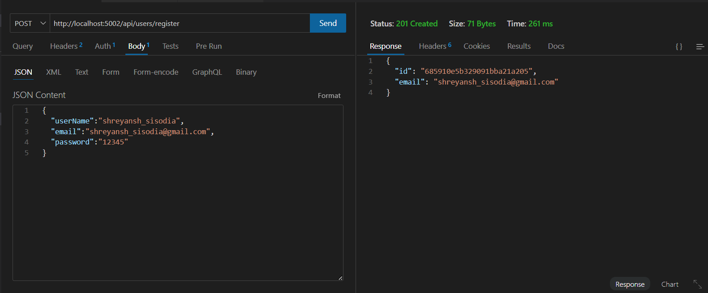
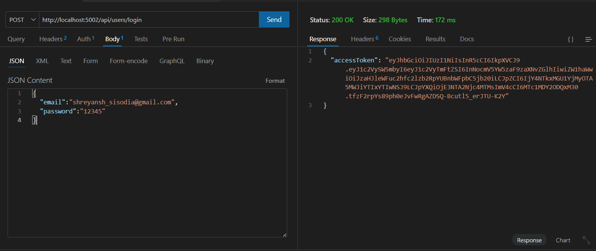
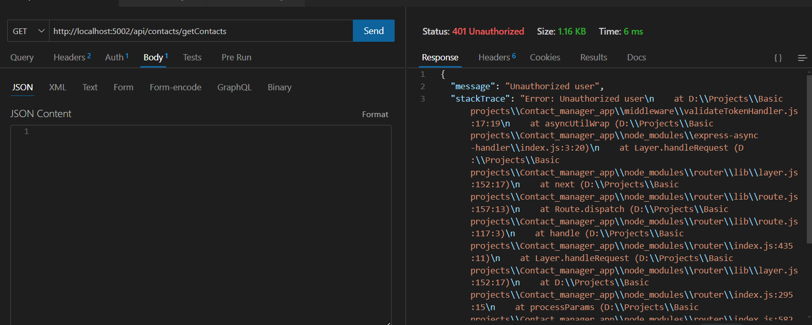
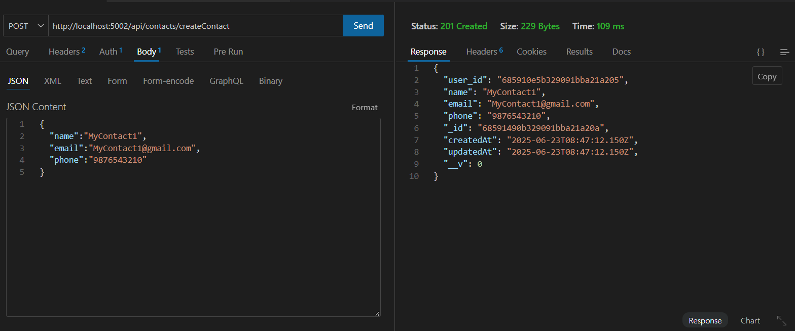
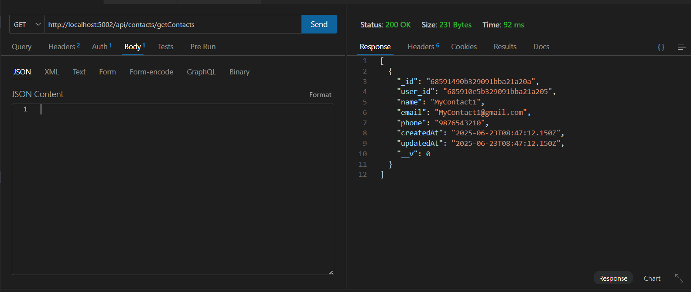
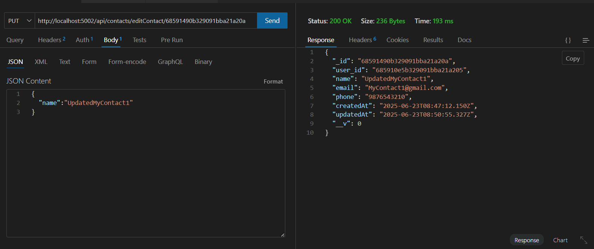
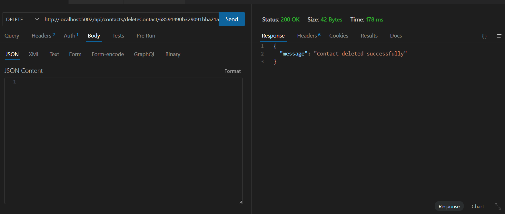

# ContactFlow-Backend
Table of Contents

1. Project Overview
2. Tech Stack
3. API Documentation
4. Error Handling
5. Authentication
6. Screenshots

---
## 1. Project Overview

A RESTful API for managing contacts with user authentication built with Node.js, Express, and MongoDB. 
### Key Features include:

- User registration and login with JWT authentication  
- CRUD operations for contacts  
- Password hashing and secure token-based authentication  
- Role-based access control  
- Robust error handling

---
## 2. Tech Stack

| Component       | Technology                |
|------------------|--------------------------|
| Backend         | Node.js, Express          |
| Database        | MongoDB (Mongoose ODM)    |
| Authentication  | JWT, bcrypt               |
| Error Handling  | Custom middleware         |

---
## 3. API Documentation

### Base URL
http://localhost:5002

### Authentication Endpoints
1. Register User
POST /api/users/register

Request Body:
```json
{
  "userName":"shreyansh_sisodia",
  "email":"shreyansh_sisodia@gmail.com",
  "password":"securePassword12345"
}
```
Success Response (201 Created):
```json
{
  "id": "6858efdbb329091bba21a1fa",
  "email": "shreyansh_sisodia@gmail.com"
}
```
2. User Login
POST /api/users/login

Request Body:
```json
{
  "email":"shreyansh_sisodia@gmail.com",
  "password":"12345"
}
```
Success Response (200 OK):
```json
{
  "accessToken": "eyJhbGciOiJIUzI1NiIsInR5cCI6IkpXVCJ9..."
}
```
3. Change Password (Authenticated)
PUT /api/users/change-password

Headers:
```json
Authorization: Bearer <access_token>
```
Request Body:
```json
{
  "oldPassword": "securepassword12345",
  "newPassword": "newsecurepassword6789"
}
```

---
Contact Endpoints (All require authentication)
1. Get All Contacts
GET /api/contacts/getContacts

Headers:
```json
Authorization: Bearer <access_token>
```
Success Response (200 OK):
```json
{
  "user_id": "6858efdbb329091bba21a1fa",
  "name": "Shreyansh sisodia",
  "email": "shreyansh_sisodia@gmail.com",
  "phone": "123456789",
  "_id": "6858f6fab329091bba21a1fe",
  "createdAt": "2025-06-23T06:40:58.909Z",
  "updatedAt": "2025-06-23T06:40:58.909Z",
  "__v": 0
}
```
2. Create Contact
POST /api/contacts/createContact

Headers:
```json
Authorization: Bearer <access_token>
```
Request Body:
```json
{
  "name": "Shreyansh sisodia",
  "email": "shreyansh_sisodia@gmail.com",
  "phone": "123456789"
}
```
3. Update Contact
PUT /api/contacts/editContact/:id

Headers:
```json
Authorization: Bearer <access_token>
```
4. Delete Contact
DELETE /api/contacts/deleteContact/:id

Headers:
```json
Authorization: Bearer <access_token>
```
---
## 4. Error Handling

| Error Case              | Status Code             | Response Example                                  |
|-------------------------|-------------------------|---------------------------------------------------|
| Missing required fields | 400 Bad Request         | `{"message": "All fields are mandatory!"}`        |
| Unauthorized access     | 401 Unauthorized        | `{"message": "Unauthorized user"}`                |
| Contact not found       | 404 Not Found           | `{"message": "Contact cannot be found"}`          |
| Internal server error   | 500 Internal Server Error | `{"message": "internal server error"}`          |
---
## 5. Authentication

- Uses JWT (JSON Web Tokens) for authentication

- Tokens expire after 10 minutes

- All contact operations require valid JWT in Authorization header

- Users can only access/modify their own contacts

## Environment Variables
The following environment variables are required:

- CONNECTION_STRING: MongoDB connection string

- SECRET_KEY: Secret key for JWT signing

- PORT: Server port (default: 3000)

## Setup Instructions
1. Clone the repository

2. Install dependencies: npm install

3. Create a .env file with required variables

4. Start the server: node server.js

---
## 6. Screenshots
### User Registration

---
### Login with Token Generation

---
### Unauthorized Access Attempt


---
### Create Contact

---
### Get all contacts of a user

---
### Update a contact

---
### Delete a contact

